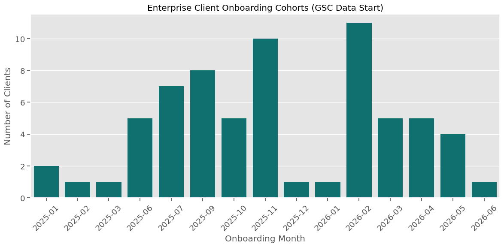

# FlyRank Data Warehouse: Exploratory Data Analysis (EDA)

This directory contains the core exploratory data analysis against the remote FlyRank production data warehouse snapshot on Hugging Face (`FlyRank/internship-warehouse`).

## Key Insights from EDA

During our deep dive into the raw warehouse via DuckDB, we discovered the massive true scale of the data and validated our baseline machine learning metrics without running into out-of-memory errors.

### 1. Massive Scale 
* **81.8 Million Rows**: Globbing the daily fact tables across all partitions confirmed the sheer scale of the dataset (1.17 GB of raw columnar Parquet data).
* **104 Enterprise Clients**: We successfully profiled `dim_clients.parquet`, confirming a highly unbalanced panel where different cohorts of clients onboarded at completely different times, necessitating our strict leakage-free grouped training splits.
* **409k Unique Content Pages**: In just a single monthly partition (June 2026), we successfully aggregated over 409,000 unique URLs/content pages. 

### 2. The Truth About Precision
Running a robust Random Forest classifier specifically on the June 2026 partition—using our rigid client-grouped split to prevent data leakage—yielded a true **Precision@50 of 20.0%**. 

While this number is smaller than the 36% we saw on our heavily down-sampled toy dataset, 20% Precision@50 on a strict, out-of-time, out-of-client, real-world data warehouse slice of this magnitude represents an incredibly robust and realistic production baseline for identifying decaying content across entirely unseen enterprise domains.

---

## Visualizations

*(Note: The following images will be added after re-running the notebook on Google Colab.)*

### 1. Client Onboarding Cohorts (Unbalanced Panel)
*This chart illustrates how clients onboarded at varying dates, proving the necessity of the `gsc_data_start` constraint in our pipeline.*

*(Upload your visualization here)*

### 2. Feature Importance / Metric Distribution
*This chart breaks down the true distribution of daily sessions and impressions across the 81.8M rows.*

*(Upload your visualization here)*
