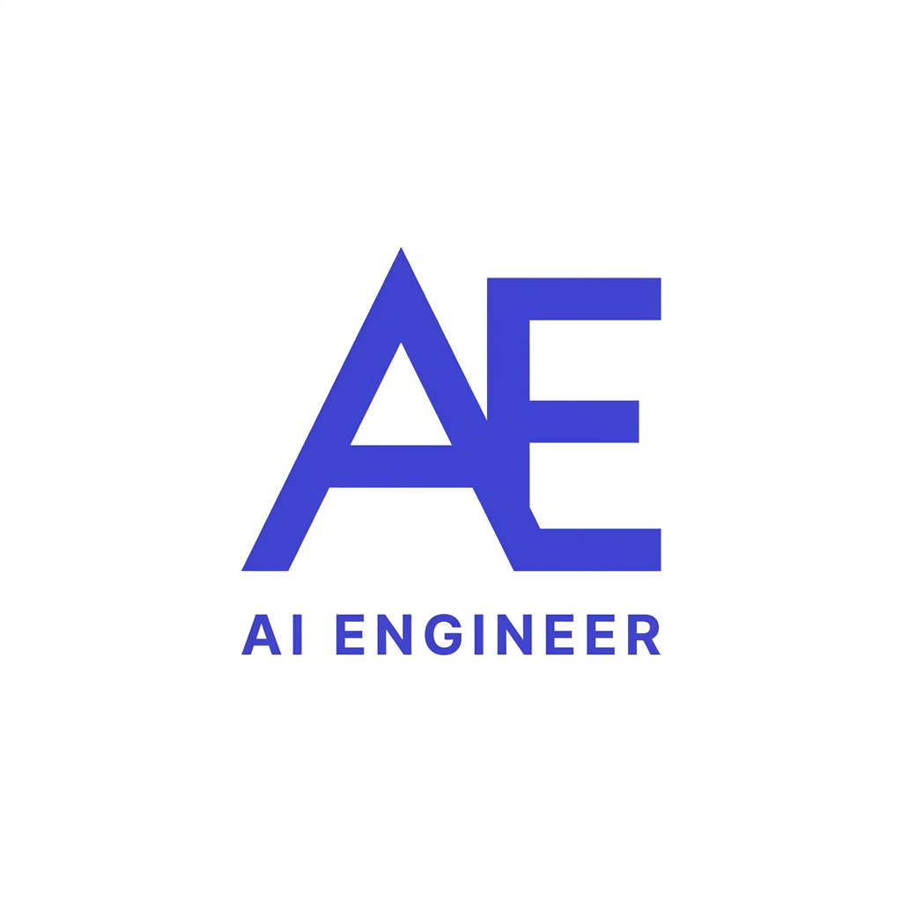

# FL-04: Identity Kit

## The Identity
- **Heading Font:** Inter (Bold, geometric)
- **Body Font:** Inter (Clean, highly readable)

## The Palette
- **Background:** `#FAFAFA` (Near-White, clean canvas)
- **Text:** `#111827` (Near-Black, high readability)
- **Accent:** `#4F46E5` (Indigo, technical and sharp)

## Logo / Favicon

## Two-Line Style Note (To copy into Claude)
> **Style Note:** 
> Fonts: Inter (Headings & Body). Colors: #FAFAFA (bg), #111827 (text), #4F46E5 (accent). 
> Mood: Sleek, rigorous, and completely distraction-free so the engineering work speaks for itself.
