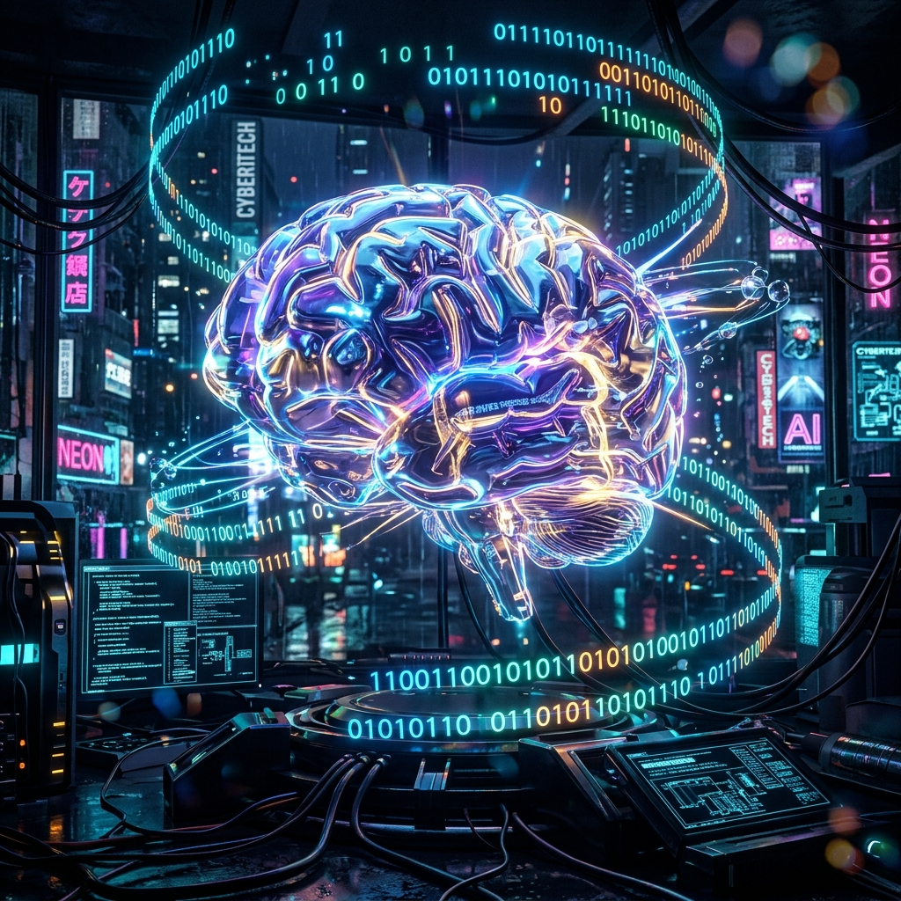

# FL-05: Image Curation

## 1. The Keepers (Final Image Set)

**Hero Texture (Connective Tissue):**

*Why:* A sleek, low-contrast geometric pattern in my brand colors (#4F46E5 on #FAFAFA). It provides a highly technical feel without distracting from the text.

**About Me:**
*Decision:* Real Photo. I am a real researcher and engineer. Using an AI-generated headshot or avatar would immediately break trust with a CTO.

**Case Study: Content Opportunity Scoring Model:**
*Decision:* Real Screenshot. I chose to use a real capture of my DuckDB output from my Colab notebook over an AI-generated "data dashboard" graphic. Real data proves I actually did the work.

## 2. The Rejection (Discernment)

**Rejected Image:**

**Why I Rejected It:**
This cheesy, glowing "cyberpunk AI brain" is exactly what you get when you ask an AI for an "Artificial Intelligence graphic." I rejected it because it violates my style note: it is noisy, distracting, and screams "amateur." A senior engineer's portfolio should look like a rigorous engineering document, not a sci-fi movie poster.
