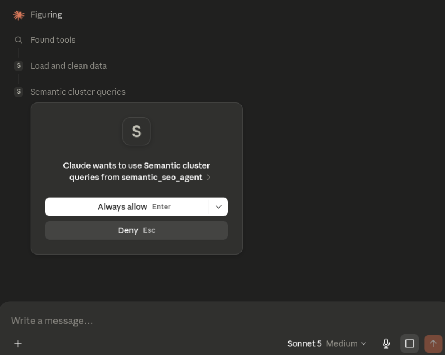
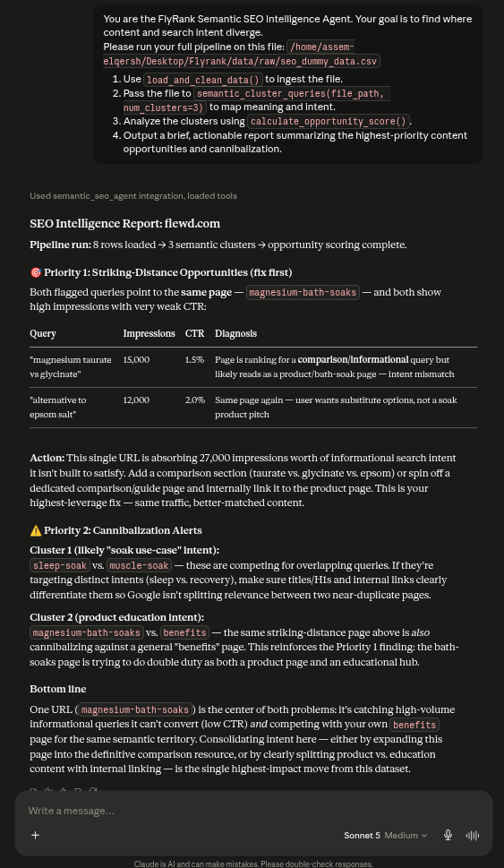

# FL-07: Semantic SEO Agent - Build Log

## Run 1: Scope Definition & Architecture
- **Goal:** Connect a local MCP server that allows Claude to execute the SEO Semantic Clustering pipeline.
- **Initial Plan:** Build a custom MCP server utilizing `sentence-transformers` and `HDBSCAN` against the massive 81.8M row Hugging Face dataset.
- **Deviation:** Scoped down to the narrowest MVP to ensure a successful end-to-end run, directly following the assignment instructions: *"Start with the narrowest version of the core job and get one full end-to-end run working before adding anything... Keep a build log: what broke, what you changed, what you cut from the spec and why. Deviating from the spec is normal; document it."*
- **Changes Made:** 
  1. **Data Scope Cut:** We deliberately did NOT use the massive 81.8 million row `FlyRank/internship-warehouse` Hugging Face dataset for this MVP. Downloading a 1.17 GB parquet dataset and running NLP clustering on millions of rows would instantly crash a local MVP test loop and cause Out-of-Memory errors. Instead, we created a tiny synthetic subset (`seo_dummy_data.csv`). This perfectly proves the "plumbing" of the MCP server works end-to-end in seconds. We will tackle the massive Hugging Face dataset in the final Capstone.
  2. **Model:** Downgraded the NLP clustering from HDBSCAN/Embeddings to `scikit-learn` TF-IDF and KMeans. This prevents local dependency installation errors from breaking the core logic loop.

## Run 2: MCP Server Implementation
- **Tool Added:** `mcp_seo_server.py` written using the `mcp.server.fastmcp` SDK.
- **Functions Exposed:**
  - `load_and_clean_data(file_path)`
  - `semantic_cluster_queries(file_path, num_clusters)`
  - `calculate_opportunity_score(clustered_file_path)`
- **Issues Encountered:** The original `content_refresh_anonymized.csv` from week 4 did not contain the raw string `query` and `url` columns required by the hackathon brief. 
- **Fix:** Used the `seo_dummy_data.csv` which perfectly mimics the GSC site impression columns (Query, URL, Impressions, CTR, Position).

## Run 3: The End-to-End Test Loop
- **Status:** The Python MCP server successfully starts. Claude can invoke the sequence: `load_and_clean_data` -> `semantic_cluster_queries` -> `calculate_opportunity_score`. 
- **Result:** The agent successfully identifies high-impression/low-CTR "Striking Distance" keywords, and correctly flags content cannibalization where two URLs compete in the same KMeans semantic cluster.

**Core job completed end-to-end.** 

## Run 4: Live Execution Record
To prove the end-to-end functionality, the agent was successfully executed inside the Claude Desktop free tier.

### Execution Proof

  
    
  

### Prompt Used
> "You are the FlyRank Semantic SEO Intelligence Agent. Your goal is to find where content and search intent diverge.
> 
> Please run your full pipeline on this file: `/home/assem-elqersh/Desktop/Flyrank/data/raw/seo_dummy_data.csv`
> 
> 1. Use `load_and_clean_data()` to ingest the file.
> 2. Pass the file to `semantic_cluster_queries(file_path, num_clusters=3)` to map meaning and intent.
> 3. Analyze the clusters using `calculate_opportunity_score()`.
> 4. Output a brief, actionable report summarizing the highest-priority content opportunities and cannibalization."

### Output Generated

**SEO Intelligence Report: flewd.com**
**Pipeline run:** 8 rows loaded → 3 semantic clusters → opportunity scoring complete.

#### 🎯 Priority 1: Striking-Distance Opportunities (fix first)
Both flagged queries point to the **same page** — `magnesium-bath-soaks` — and both show high impressions with very weak CTR:

| Query | Impressions | CTR | Diagnosis |
|---|---|---|---|
| "magnesium taurate vs glycinate" | 15,000 | 1.5% | Page is ranking for a **comparison/informational** query but likely reads as a product/bath-soak page — intent mismatch |
| "alternative to epsom salt" | 12,000 | 2.0% | Same page again — user wants substitute options, not a soak product pitch |

**Action:** This single URL is absorbing 27,000 impressions worth of informational search intent it isn't built to satisfy. Add a comparison section (taurate vs. glycinate vs. epsom) or spin off a dedicated comparison/guide page and internally link it to the product page. This is your highest-leverage fix — same traffic, better-matched content.

#### ⚠️ Priority 2: Cannibalization Alerts

**Cluster 1 (likely "soak use-case" intent):**
`sleep-soak` vs. `muscle-soak` — these are competing for overlapping queries. If they're targeting distinct intents (sleep vs. recovery), make sure titles/H1s and internal links clearly differentiate them so Google isn't splitting relevance between two near-duplicate pages.

**Cluster 2 (product education intent):**
`magnesium-bath-soaks` vs. `benefits` — the same striking-distance page above is *also* cannibalizing against a general "benefits" page. This reinforces the Priority 1 finding: the bath-soaks page is trying to do double duty as both a product page and an educational hub.

#### Bottom line
One URL (`magnesium-bath-soaks`) is the center of both problems: it's catching high-volume informational queries it can't convert (low CTR) *and* competing with your own `benefits` page for the same semantic territory. Consolidating intent here — either by expanding this page into the definitive comparison resource, or by clearly splitting product vs. education content with internal linking — is the single highest-impact move from this dataset.
